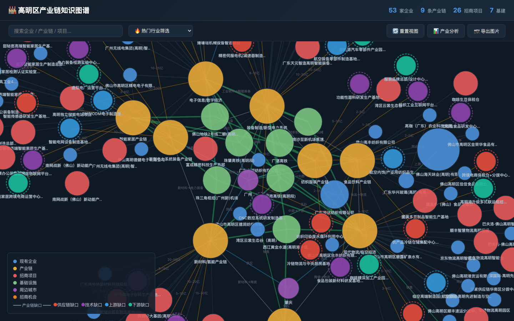
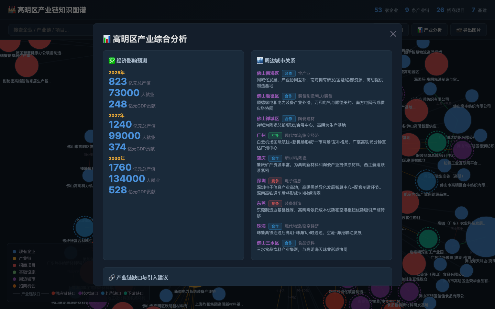
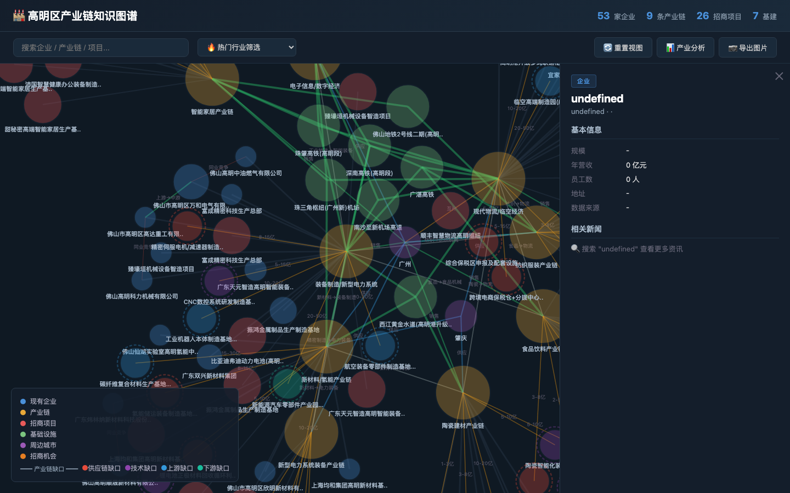
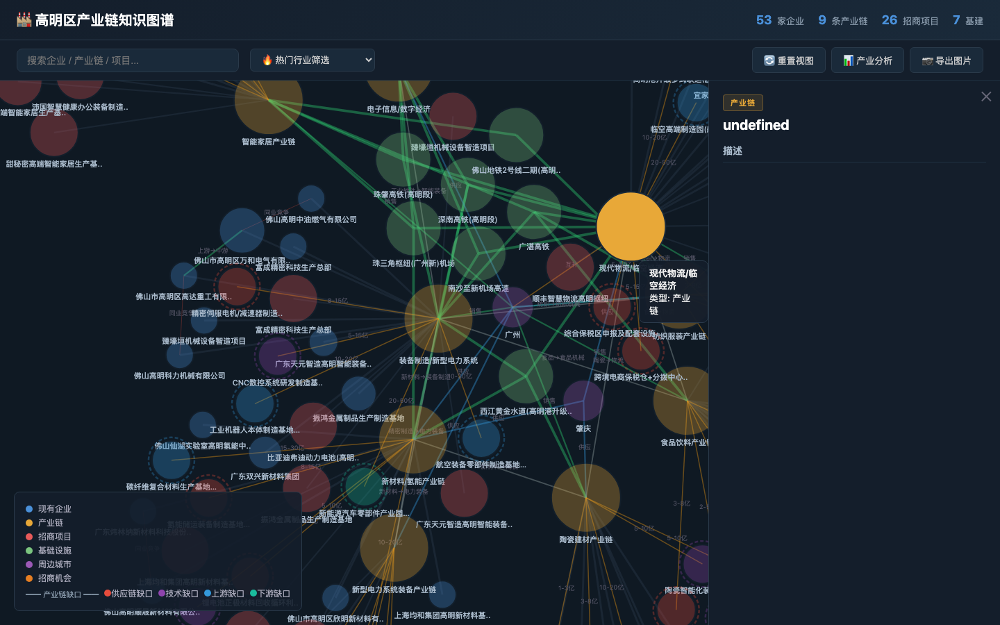
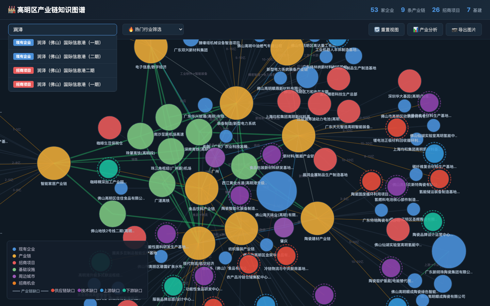
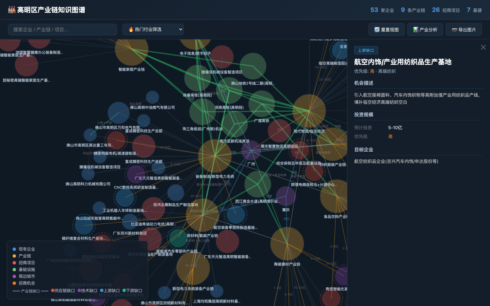
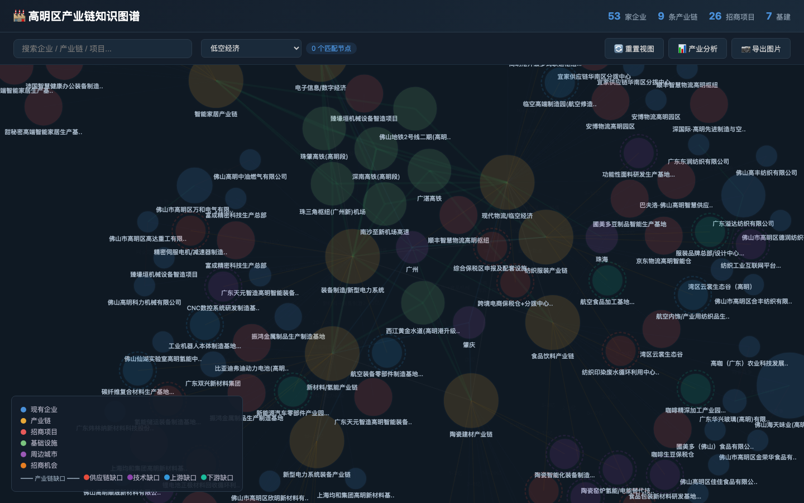

# 🏭 高明区产业链知识图谱

基于 NetworkX + FastAPI + D3.js 的高明区产业知识图谱系统，整合企业数据、招商引资、基建规划（广州新机场/广湛高铁），提供产业链全景分析和交互式可视化。

## 📸 系统截图

| 图谱主视图 | 产业分析弹窗 |
|:---:|:---:|
|  |  |
| **企业详情面板** | **产业链详情** |
|  |  |
| **搜索功能** | **产业链缺口节点** |
|  |  |
| **热门行业筛选** | |
|  | |

## 数据规模

| 指标 | 数值 |
|------|------|
| 企业 | 53 家（含纺织、陶瓷、装备、食品、新材料、物流、电子信息、智能家居、电力装备） |
| 产业链 | 9 条 |
| 招商项目 | 27 个（2026年真实数据，意向投资超260亿） |
| 招商机会点 | 45 个（含供应链缺口/技术缺口/上游缺口/下游缺口分类标注） |
| 基础设施 | 7 项（机场/高铁/地铁/港口/高速） |
| 热门行业 | 18 个（国内国际热点行业快速筛选） |
| 图谱节点 | 130+ 个 |
| 图谱关系 | 180+ 条 |

## 功能

- **企业图谱**: D3.js 力导向图展示企业/产业链/招商/基建/城市/机会点六类节点关系，可点击查看详情
- **产业链分析**: 9 大产业链全景分析，含缺口识别、招商机会、引入建议
- **招商引资**: 已落实项目在产业链中的定位，与现有企业的协同关系
- **招商机会**: 45个产业链缺口机会点（供应链缺口/技术缺口/上游缺口/下游缺口），分类标注优先级和投资规模
- **产业链缺口识别**: 4类缺口分类（供应链缺口🟥、技术缺口🟪、上游缺口🟦、下游缺口🟩），虚线外圈标注
- **热门行业筛选**: 18个国内国际热门行业快速筛选（低空经济、AI大模型、氢能、半导体、机器人等），一键高亮匹配节点
- **基建影响**: 广州新机场(2026.3动工)、广湛高铁(已通车)、珠肇高铁等产业带动
- **城市关系**: 25条城市产业链上下游关系（上游供应/下游销售/互补/竞争）
- **经济预测**: 2025→2027→2030 各产业链产值(1760亿)、就业(13.4万人)、GDP贡献(528亿)
- **智能搜索**: 企业/产业链/项目名称实时搜索
- **飞书推送**: 产业链分析报告+截图推送到飞书群

## 快速启动

```bash
# 一键启动
./start.sh

# 或手动启动
pip install -r requirements.txt
python3 backend/main.py

# 打开浏览器访问 http://localhost:8001
```

## 飞书推送

```bash
# 推送产业链分析报告
python3 backend/hermes_push.py

# 推送截图到飞书
python3 backend/push_screenshots.py
```

## 生成可视化报告

```bash
# 生成交互式 HTML 图谱 + JSON 摘要
python3 backend/push_viz.py
```

## 项目结构

```
gaoming-industry-chain/
├── backend/
│   ├── main.py                  # FastAPI 后端 API
│   ├── database.py              # SQLite 数据库层
│   ├── data_collector.py        # 企业/招商/基建/机会/城市流动数据
│   ├── graph_builder.py         # NetworkX 知识图谱 + 分析引擎
│   ├── hermes_push.py           # 飞书报告推送 (Hermes接口)
│   ├── push_screenshots.py      # 飞书截图推送
│   ├── capture_screenshots.py   # Playwright自动截图
│   └── feishu_bot.py            # 备用飞书Webhook推送
├── frontend/
│   ├── index.html               # D3.js 力导向图前端
│   ├── style.css                # 深色主题
│   └── app.js                   # 图谱交互 + 搜索 + 分析
├── assets/                      # 系统截图 (用于README)
├── data/                        # 数据库和生成报告
├── start.sh                     # 一键启动脚本
├── requirements.txt
└── README.md
```

## 数据来源

- 高明区 2026 年高质量发展大会公开信息（34个/230亿签约项目）
- 南方日报/佛山新闻网 公开报道
- 广东省交通运输规划/铁路建设规划
- 企业公开工商信息

## 技术栈

- **后端**: Python 3.11, FastAPI, NetworkX, SQLite, PyVis
- **前端**: D3.js Force-Directed Graph, HTML5/CSS3
- **截图**: Playwright headless browser
- **推送**: 飞书自定义机器人 / 飞书开放API (Hermes)
- **数据**: 2026年公开报道数据
